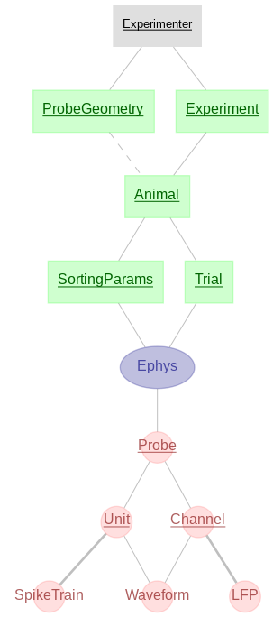

User Interface
==============

Access/installation
-------------------

How you access the GUI depends on your infrastructure and how your database administrator setup Antelope.

Desktop app on shared machine
^^^^^^^^^^^^^^^^^^^^^^^^^^^^^

Antelope is designed to be run on a shared linux machine, such as a cluster head node. However, users need to access Antelope from their own machines. Since Antelope is a graphical application, we recommend using `X2Go <https://wiki.x2go.org/doku.php>`_, which enables you to run graphical applications on a remote machine. You should install the X2Go client on your Windows, Mac or Linux machine.

Inside the X2Go Client, you should start a new session, which you can name 'Antelope'. You then need to enter the host machine on which Antelope is installed, and your username. Under 'Session type', you want to select 'Single application' in the dropdown box. You then need to enter the command that runs Antelope, which should be of the form::

    /path/to/antelope.sh

Where your database administrator will give you the path for your particular installation.

Additionally, you should click on the media tab and uncheck 'Enable sound support'.

Optionally, under the shared folders tab, you can select data on your local machine that you want to use within Antelope. This could be a folder on your machine where you store trial data, for example. To do this, click on the folder icon and navigate to the folder you want to use in Antelope, then click 'Add'. Make sure you select the 'Automount' checkbox. This data will show up under the 'local' folder inside Antelope.

Once you're happy with all your options, click 'Ok'. We then recommend that you make a desktop shortcut to Antelope for easy access. Click on the options button for the Antelope session, and select 'Create session icon on desktop'.

With this initial setup complete, you now just need to click on the Antelope desktop shortcut, and enter your password, and Antelope will boot. There is no further setup required - everything should just work out of the box, including tools such as Phy, scheduling jobs on the cluster, and connecting to your lab's database. Note Antelope can take a while to boot up - sometimes around fifteen seconds.

Persistent webapp
^^^^^^^^^^^^^^^^^

If you are using a persistent web interface hosted on a dedicated lab server, you will simply need to navigate to the URL in your web browser given to you by the database administrator from within your institution's network (or using a proxy or VPN if outside the network).

Note however that the web version of antelope is slightly more limited - you cannot display certain graphical applications such as phy, and may not be able to schedule jobs depending on whether your cluster is directly accessible via SSH.

Usage
-----

The GUI is designed to be as intuitive to use as possible. However, users do need to familiarise themselves with the Antelope schema shown below.

    Antelope database schema

In general, a relational database consists of a set of distinct tables, which have rows and columns. The columns define the attributes of the table, while the rows represent different data entries in that table. One or more attributes together define the **primary key** for that entry - this has to be a set of attributes that uniquely defines that entry in the table. In addition, attributes can be a **foreign key**, which is the primary key of an entry in a different table. In this way, that entry references an entry in a different table. Other attributes contain specific information about that entry in the table.

The diagram above depicts the structure of our database. A table which is below another table, connected by a solid line, references the table above it in its composite primary key. We can think of entries in such a table as belonging to the entry in the table above it - for example, an animal belongs to an experiment. In addition, the dashed lines refer to foreign keys which are not primary keys of the table. Such a table refers to but does not belong to the table it references. For example, an animal has a probe inserted into it for electrophysiology, but we do not think of the animal as belonging to its probe.

A DataJoint pipeline consists of a few different table types. The green tables are **manual** tables, which require manual user input to populate them. In our pipeline, the first manual tables define the experiments, the animals used in these experiments, the geometries of the probes inserted into these animals, and the trials done per animal. These tables successively inherit from each other, which means that an experiment belongs to an experimenter, an animal belongs to an experiment, etc. Users need to manually fill out these tables in order - so if you have a trial for a new animal, you have to first add that animal to the animal table, then add the trial for that animal.

The grey tables are **lookup** tables, which have data that is predefined by the database administrator, and do not require user interaction, such as the set of experimenters belonging to a lab.

Further downstream in the pipeline, we encounter **computed** tables in red, which do not require any manual input, but are automatically populated by computation. Computed tables are fully reproducable - they can be deleted and have their entries reinstated by rerunning the computation that populated them. In our case, these computations take the form of predefined nextflow pipelines.

Additionally, we have **imported** tables in blue. These tables track data outside the pipeline, but otherwise, are the same as computed tables. We use them for a very specific purpose, which is tracking the results of manual curation. Manual curation data is large and fairly unstructured. We feel it is not critical to store this data in the antelope pipeline explicitly. Instead, we use external storage space on the cluster, and track these external files. In the event of the loss of this external data, the curated spiking data will still be in the database, but the exact manual curation steps will not be reproducable.

In our pipeline, users first fill out the tables for their experiment, animals and then trials. These contain the relevant information about their entries, including experimental optional notes. A trial entry contains the raw experimental data for that trial - users simply select the output folder from their acquisition system and this gets uploaded to the database alongside the other attributes. An experiment refers to a large set of trials with a cohesive experimental structure or research aim, potentially taken over the course of many months. For example, an experiment could consists of many recordings of different animals performing a single behavioural task, that you may want to analyse in unison down the line to form a part or all of a publication. A trial would then consist of a single recording of one iteration of this behavioural task.

For each animal, the user can additionally define a number of different sets of sorting parameters. The user can then schedule a spikesorting job which will use the parameters assigned for all their data. However, the behaviour of this pipeline depends on whether there is one or more parameter sets for this animal. In particular, our intended usage is that when a new animal is added, the user will test a number of parameter sets in parallel. They can then explore the results in phy, and choose the optimal parameter set to keep for this animal, at which point the spikesorted data will automatically get uploaded to the electrophysiology tables, which include information on the unit spiketrains, LFPs, etc. When there is only one parameter set for a given animal, the nextflow pipeline will then automatically fill out these electrophysiology tables for each new computation. At any point, a user can choose to go back and manually curate the sorting results for a trial, at which point the electrophysiology tables will get overwritten by this new data.

Basic usage
-----------

Once you have opened the application, you first need to login. Your database administrator should have sent you your credentials.

The Antelope app consists of different pages, selected in the sidebar on the left.

Search
^^^^^^

First of all, the **search** page allows you to search the database to see what data it contains. This page has two modes of operation: sequential filter mode, and manual query mode. Sequential filter mode is the easiest to use and is preferred for simple queries, while manual query mode allows you to programmatically enter more complex database queries.

In sequential filter mode, you first need to select the table you would like to search. You will only be able to select tables that already have data in them. You then have the option to sequentially filter results for that table with the dropdown boxes. At any point, you can leave the bottom box blank, which means no further filters will be applied. For example, if you want to search all trials belonging to an individual animal, you would select the Trial table at the top, and then sequentially select the **experimenter**, **experiment_name**, and **animal_name** attributes. You would then leave **trial_name** blank. Note that the available selections depend on the selections made previously - for example, you can only select animals belonging to the experiment you have already chosen.

In manual query mode, you need to type a query. For this, we use the DataJoint query syntax. This syntax involves specifying the names of the tables you are querying, alongside query operators that manipulate the results of the query. We give here a brief description of these operators. For a full description, we refer you to the `DataJoint documentation <https://datajoint.com/docs/core/datajoint-python/0.14/query/operators/>`_.

.. csv-table:: DataJoint Query Operators (source: DataJoint documentation)
   :header: "operator", "notation", "meaning"

   "restriction", "A & cond", "The subset of entities from table **A** that meet condition **cond**"
   "restriction", "A - cond", "The subset of entities from table **A** that do not meet condition **cond**"
   "join", "A * B", "Combines all matching information from **A** and **B**"
   "proj", "A.proj(...)", "Selects and renames attributes from **A** or computes new attributes"
   "aggr", "A.aggr(B, ...)", "Same as projection but allows computations based on matching information in **B**"
   "union", "A + B", "All unique entities from both **A** and **B**"

As an example, consider the following query::

    Experiment * Animal & 'experimenter="rbedford"' & 'ml_coord > 10'

This will join all the attributes from the Experiment and Animal tables, and will return the entities belonging to **rbedford** with a medial-lateral insertion coordinate greater than 10.

One final difference with manual query mode is that we don't automatically filter out temporarily deleted entries. This is so that you can have the flexibility to search whatever data you have in the database. If you want to filter out temporarily deleted entries, then you simply need to add the restriction 'tablename_deleted="False"' to your query.

For both modes of operation, you can then click on the **Search** button, which performs a query on the database. It displays a dataframe of the results of this query, showing up to 30 items, as well as a count of the total number of items. It does not show large datafiles kept in external stores, or jsons, but represents them by placeholders.

You then have two further options: download, or delete. You can download the results of any search, from either the sequential filter or the manual query. You need to first select a location to download the data to. The available options are the result of the configuration performed by your database administrator, and must be paths accessible to the machine on which antelope is running. It will download all data resulting from the search, not just the 30 that are displayed. The data will be downloaded as a single numpy recarray, and the file will be named based on the exact search you are performing. Recarrays are essentially pandas dataframes, and so pandas is the recommended library to load and work with your results. The following script gives a simple example of how to do this::

    import numpy as np
    import pandas as pd

    df = pd.DataFrame(np.load('/path/to/download.npy'))

In addition to the main array, external data will also get downloaded. For example, the zipped raw trial recordings will get downloaded into the same working directory. In the dataframe column referencing the external attribute will be relative paths to the external files. If you want to do custom manipulation on the external data you've downloaded, you could, for example, loop through the dataframe and use the paths to refer to the data for further manipulation, such as unzipping and processing with spikeinterface. Note that the paths in the array won't change if you move the data. Therefore, it is recommended to download to an empty directory and move the entire directory so that the references still work. Additionally, note that downloads can overwrite data which already exists with identical file names. This will only pose a problem if you repeatedly perform the same download to the same location, which is not recommended.

You can also delete the results of any sequential filter, and some manual queries, such as a single table with certain restriction filters applied, as long as the data belongs to you. You cannot delete from overly complex manual queries such as joins, as it wouldn't be clear what table you want to delete from. The app will warn you if a query can't be deleted. Deletions cascade to avoid orphaned database entries. This means, for example, that deleting an animal will also delete all the trials, spikesorting parameters and electrophyiology entries that belong to that animal. Pressing the **Check Deletes** button will show you the number of entries in each downstream table that will get deleted, whcih acts as a good check that you realy want to perform this deletion. Deletions are temporary, and can be reversed, but only by your database administrator, so it is worth double checking any deletes you want to perform. Some caution is necessary; you could, for example, delete the experiment table with no filters other than your username, which will delete all your data in antelope. For this reason, we ask you to re-enter your password to confirm deletion.

Note that both downloads and deletes can take quite some time, depending on the size of the data, and in particular, whether the data refers to large external files. For this reason, both downloads and deletes always occur in a background thread. To check the status of your download or delete, press the **Check download progress** or **Check delete progress** buttons. Note that if you quit the application while one of these background processes is underway, they will still continue to completion, however, you will lose the ability to check their status when you log back in. Therefore, it is recommended to keep antelope open when you have downloads or deletes underway. If you do accidentally close antelope, you can always check whether they completed by looking at the file system or searching the database.

Insert
^^^^^^

The **insert** page allows you to manually insert information about your experiments, animals, probe geometries, and trials. The dropdown box at the top allows you to choose the table into which you want to insert an entry. Below this is a brief description of the table attributes, including their names, data type, and a brief comment describing what each attribute means. Note the dashed line separates the primary key attributes from the secondary attributes for that table.

You can then sequentially input information for each attribute in the table. How data is input depends on the data type and whether it is a foreign key or not. For example, some attributes require you to type some text, while others may require you to select a file or directory to upload. Foreign key integrity is enforced here from top to bottom, which means that if you select a particular experiment, you will only be able to select an animal that already belongs to that experiment, etc. It is therefore necessary that you enter your attributes from top to bottom.

Each manual table has a 'name' attribute. This should be used to uniquely identify that entry. Under the hood, we make use of autoincremented primary keys to identify different entries, but the name attribute is very useful for you to use when searching the database. We recommend having a common convention across the lab. For example, you will probably alread have an animal naming convention involving the animal's strain, gender, number, etc. So it is worth using that convention in antelope, but this is up to you to adhere to. It is fine if the name is not unique across different parents - for example, you could use the same animal in two different experiments. But your data will get hard to search if you use the same animal name twice within the same experiment. Additionally, the 'notes' attribute is for your own annotations, and can be useful in identifying different table entries.

The **ProbeGeometry** table holds information specifying the geometry of the probe that will get inserted into the animals. This needs to be a json file in `ProbeInterface <https://probeinterface.readthedocs.io/en/main/>`_ format. This file needs to be present on your cluster storage space for you to upload it. Some common probe files can be found in the `ProbeInterface Library <https://github.com/SpikeInterface/probeinterface_library>`_, and we are hoping the number of probes here will be expanded upon shortly. For custom probe designs, such as a multiple tetrode configuration, you will need to use ProbeInterface in python to programmatically create your file.

Some aspects of this require quite a bit of care. It is very important that you check your channel configurations and make sure this is consistent between your acquisition system and your probe file. Otherwise the calculated unit locations will be meaningless, and even worse, your spikesorting results may be meaningless, as many modern spikesorters explicitly use the probe geometry in their calculations. It is also important to specify the global location and rotation of the probe, for localisation of detected units. Probe insertion coordinates are calculated from the insertion rotation angles and depths in the animal table. This transforms the probe geometry into stereotaxic coordinates.

Finally, once your data has been entered, you can press the **Insert** button, which uploads this data to the database. Just like with downloads and deletes, inserts can take a long time, particularly if you are uploading large raw recordings to the database, so they occur in a background process which you can monitor with the **Check insert progress** button.

Electrophysiology
^^^^^^^^^^^^^^^^^

The **electrophysiology** page allows you to insert spikesorting parameters, schedule spikesorting jobs on the cluster, and manually curate your results in phy.

Under the **Insert parameters** tab, you can add spikesorting parameters for a given animal. Before describing how to use this page, it is worth discussing the electrophysiology data that is extracted from the raw recordings. In any extracellular electrophyiology recording, the crucial data to extract is typically the spiketrains, LFPs, and unit waveforms. We aim to facilitate analysis by providing this data as numpy arrays that can be easily fetched through database queries. Importantly, for a given trial, these arrays should share a common clock, and their units and sample rates should be attached as metadata in the database. As a user, you therefore need to enter parameters for spikesorting, including preprocessing parameters, and additionally, extraction parameters detailing exactly how these arrays should be extracted.

After selecting the animal you want to add parameters to, you can then select the LFP cutoff frequency. In SpikeInterface, LFPs are bandpass filtered (not lowpass filtered), so we fix the minimum frequency to 1 Hz. To be efficient in our storage, we also resample the array to be slightly above the Nyquist frequency, as this will retain all the spectral information while reducing the size of the array.

Waveforms are computed simply by slicing the preprocessed recording around the peak of the spike. You can choose how long before and after the peak to retain. Waveforms are stored at the original recording sample rate since we want the highest fidelity possible.

Preprocessing is applied to the recording before spikesorting. We apply just a bandpass filter - some spikesorters will internally also then apply whitening. You can choose the minimum and maximum frequencies for the bandpass filter.

You can then choose which spikesorter you would like to run. At present, we provide pykilosort, spykingcircus2, and mountainsort5. Each spikesorter has its own set of parameters. Often, many of the defaults will be fine, but certain parameters are very important, such as whether your spikes peak posiitvely or negatively, which can depend on your acquisition system. Antelope attempts to give a description of each parameter if it's available. However, we strongly recommend that you read the documentations for these individual spikesorters if you are going to use them a lot, try to understand their parameters, and make sure you test a range of parameter sets.

If you only select one spikesorter, then its output will get uploaded to the database directly. This is a sensible approach when combined with manual curation in phy, but at present, may not give optimal results if left as is. We therefore allow you to select more than one spikesorter to run in parallel. We will then run an agreement matching algorithm on the results, which tries to match units from different spikesorters based on their spiketrains. This can lead to more robust results in the absence of spikesorting. However, it can also be quite a harsh algorithm, leading to only a small number of units being truly matched and uploaded to the database. We therefore recommend that you set the agreement matching parameters generously - ie, a high **delta_time**, and a low **match_score** (the defaults should be adequate). You can always manually curate these results too.

You can then name your parameter set and add a description to make database queries easier, and upload these parameters to the database.

Under the **Spikesorting** tab, you can then schedule spikesorting jobs to run on the computing cluster. These jobs are highly parallelised, so they run efficiently and quickly given your cluster resources. They automatically pull all the necessary data from the database, and upload their results to the database at the end.

You need to select the subset of your data that you want to run spikesorting on. Each trial will get spikesorted multiple times depending on how many distinct parameter sets you have for the animal the trial belongs to, and all of this data will get uploaded to the database. In general, this is not the behaviour that we want, as we only want the results of a single, near-optimal spikesorting. However, this feature allows you to quickly try a number of different parameter sets on a small number of trials for a new animal, explore their results in phy, then discard all but the best parameter set. For the bulk of your experiment, you should then be spikesorting with a single parameter set, to save on processing and storage resources.

Once you've selected some data to spikesort, you can check the number of trials and parameters, as well as the total number of jobs that will be run for this selection. Don't worry about scheduling many jobs, such as every trial from a month's worth of experiments; the parallelisation is handled under the hood by nextflow and is designed to not overwhelm your HPC limits, as configured by your database administrator, while still being as fast as possible. To then schedule your spikesorting job, you must first enter your cluster password, then press **Schedule spikesorting**. Note this is different to your antelope password which you used to login to the app - it will be the same password you used to login to the machine on which you are running the app. Once your job is running, you can monitor its progress with the **Check spikesorting progress** button. You will also receive an email confirmation once your job completes.

Under the hood, we monitor what entries are currently in computation as a means of enforcing database integrity. Any data linked to data that's currently in computation can't be modified or deleted, and you will get errors if you try. This is because the computational pipelines take a snapshot of the data they depend on as they start, perform their calculations, then upload their results at the end. If the data they depend on changes mid-computation (for example, you modify some spikesorting parameters while that spikesorting job is running), the results uploaded to the database will be the results of the older set of parameters, while the database will tell you they are the results of the newer parameters you just inserted.

Note that computational jobs do of course fail occasionally. This can be for a number of reasons, the most common ones being that you have uploaded data that is somehow incorrect or corrupted, that it has failed due to a faulty parameter, or that the job has exceeded its computational resources on the cluster. You can check the issue by reading the logs in the email sent to you by nextflow. In the meantime, the job will remain in the 'in computation' state. This is to avoid that job being rerun before the problem is fixed, which would waste resources. Once you have figured out the issue, you will need to get your database administrator to release that job from computation for you, after which you can either fix the problem and reattempt the job, or delete that entry.

Once you have some data that has been successfully spikesorted, you can move on to the **Manual curation** tab. All manual curation in Antelope is done with `Phy <https://phy.readthedocs.io>_`. You can then select the data you want to curate, and press the **Open phy** button. Phy is a graphical application, and will open in a new window - note this can take a few seconds. This will open Phy with the selected data. You can then curate your data as you normally would in Phy. Once you are happy with your curation, you can press the **Upload curation** button. Uploading these results is quite computationally intensive, as a lot of data conversion needs to take place, including reextracting the waveforms from the raw recording. Therefore, this gets scheduled onto the HPC like the spikesorting job. It is therefore advisable to avoid running this job an unnecessary number of times.

Note that even if you don't intend to perform manual curation, Phy is still a fantastic visualisation tool for you to explore your spikesorting results, particularly at the beginning of a new experiment when you're going to be validating your parameters. To aid with this initial assessment of your parameters, we also give you the option to delete poor parameter sets in this tab.

Admin
^^^^^

Note that the **admin** page is only available to database administrators. This page allows database administrators to restore temporarily deleted data, permanently delete data, and release data from computation.

If you are familiar with the rest of Antelope then the admin page should be self-explanatory. However, the exact behaviour of certain functions here need discussing, particularly with regards to data integrity. In particular, it is important that no undeleted entries have deleted parents - for example, a non-deleted trial in the database can't belong to a deleted animal. The behaviour of the cascading needs to ensure this relationship always holds.

You can therefore only restore entries that have parents that are undeleted, such as a deleted trial with an undeleted animal. These restores cascade, so restoring a trial will also restore all of its attached electrophysiology data, for example.

You can permanently delete any temporarily deleted entries, regardless of the state of their parents. Permanent deletes also cascade. This option should be used with the utmost caution!

You can also release entries from computation. Before doing so, make sure you understand why this computation failed. For electrophysiology, the computational state is tracked through the ephys table. The behaviour here depends on whether the computation was a spikesorting job, or reuploading the results of manual curation. In the spikesorting case, this amounts to a permanent delete of the ephys entry. This is because there is no downstream data that needs to be kept, and we need to free up the ephys entry so the spikesorting job can see that this entry hasn't yet been computed. On the other hand, if it got stuck while reuploading manual curation data, the behaviour is to simply revert the ephys entry back to the not in computation state. This is because there is important downstream data that needs to be retained.
