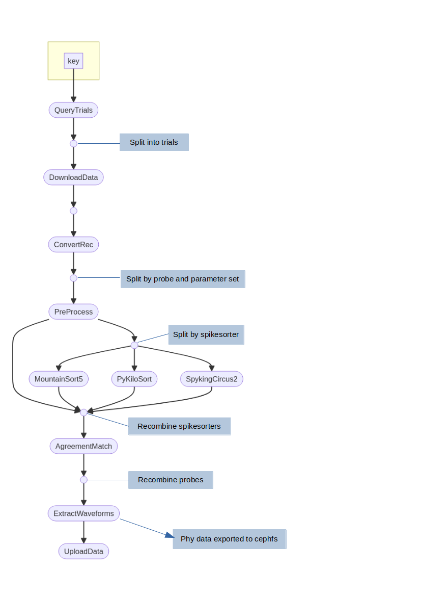

Nextflow Pipelines
==================

Pipeline details
----------------

The pipelines are all in the Workflows branch of the repository.

Some general pipeline notes
^^^^^^^^^^^^^^^^^^^^^^^^^^^

Antelop is built on top of DataJoint. However, it is not actually a DataJoint pipeline as DataJoint pipelines are intended to be constructed. The reason for this is that we found DataJoint to be lacking in functionality when it comes to how computations are performed. In fact, DataJoint computations, defined within a table's make() function, and called by running populate() on that table, are actually only designed to be run locally and sequentially. For large computations, such as running a number of spike sorters in parallel, this is very restrictive.

We therefore designed our computations as a set of distinct Nextflow pipelines. Each pipeline can be called from the web interface, and take the primary keys of the dependent entries as input parameters. Nextflow is a fantastic tool for complex pipeline construction as it allows dependencies between different jobs to be easily specified, and supports a range of computation engines to be used under the hood, which allows us to configure Antelop to run on a HPC using the SLURM job scheduler, or to run computations on a dedicated compute server, or to run them locally, on AWS, etc.

Our pipelines are all designed so that they first query the database to figure out which attributes to run for. For example, if you are spikesorting, you can perform a single computation by inputting a session key, just like running a single datajoint make() computation. Alternatively, you can input an experiment or animal key, and then the computation will occur for all sessions that belong to this key in parallel, up to the limits on cluster resources you have configured. This makes computation much, much quicker than running a datajoint populate() call, which will run computations one after the other. So the first nextflow process is this initial query, which fetches the keys deriving from the input parameter which have not been computed yet (such as all new sessions belonging to the input experiment). These keys are then fed as different entries into a nextflow channel, and run in parallel for the rest of the pipeline. Future nextflow processes then download any raw data needed, perform computations, and upload the results, all again in parallel.

It is worth noting the challenges involved with running jobs on a HPC that pull data from a MySQL database. Namely, we do not know when a scheduled job will run. If the user schedules a job, then edits any of the dependent tables before the job runs, the job will fetch the data **as it is when the job runs**, not as it is when the job is scheduled. There is no simple way around this issue, so it is important that users are aware of this, or else they may get unexpected results. This in itself is not a major issue.

A bigger issue is the potential risk of the database being changed **during a computation**. This would lead to a loss of integrity of the database - the downstream populated tables could end up not actually being the results of computations on the data they depend on but on that data's historical value before the data was edited. This does pose a genuine risk when computations are long or cluster queues are long. The solution we use for this is to fetch all the necessary data for the computation at the start of the pipeline, and then lock the rows from which the data was fetched. We then perform our computations, upload the results at the end, and unlock the corresponding rows.

This also gets around the related issue of users being able to perform computations on overlapping queries. For example, if a user schedules a spikesorting on an animal, then shortly after they schedule spikesorting on the experiment that animal belongs to, the animal could end up having all its sessions spikesorted twice, wasting resources, since the second job will see that that animal doesn't have any results yet, since its computation is still underway, and will also spikesort it. Therefore our initial database query checks the keys which haven't yet been computed over, and which are not currently locked. This allows for lazy user usage of the pipeline - you could just schedule spikesorting for your experiment each time you upload a new session, and it will only run over the new data, avoiding any redundant calculations.

MySQL doesn't allow row-based locking. We therefore implement this at the application level. How this is done depends on the workflow being run, but involves changing the `in_compute` attribute of the appropriate parent table to 'True' for the entirety of the pipeline run, only changing it back to 'False' afterwards. The `spikesorting` and `import_phy` workflows implement this with the `spikesorting` table. All entries downstream from a `in_compute` entry then can't be modified or deleted, enforced both within the permissions patching described in :ref:`permissions` and in the gui for clarity.

Another issue is that if many different entries are computed in parallel, they may all get inserted into the table at the same time, which could overload the database I/O and lead to performance issues for other users. It's therefore crucial when inserting results at the end of the pipeline that inserts are batched as far as memory allows. With varying runtimes for each computation, we haven't encountered issues with this yet, but if it does become a problem in the future, a possible solution would be to query the network traffic prior to an insert, and wait until it drops below a certain threshold before inserting.

Running pipelines
-----------------

Pipelines are run via the `submit.sh` script in the root of the repository. It is recommended to only do this through the gui as the arguments to this script are quite complex. They include, in order:

1. The primary key of the data to be run on
2. The date as a subdirectory
3. The workflow to be run
4. The environment variables as a string containing all the necessary credentials
5. The estimated runtime of the job as a slurm time string

This script then triggers the appropriate `main.slurm` script, which is a single core slurm script that runs nextflow. The nextflow pipeline then triggers a number of other slurm jobs internally, that all run on the cluster in singularity containers.

Spikesorting pipeline
---------------------

   Antelop spikesorting pipeline

Here we will detail the different processes in the spikesorting pipeline. Note the entire pipeline takes a key specifying a DataJoint restriction as input. All processes run in the appropriate singularity container - which could be our antelop_python container if they interact with the database, or the spikeinterface container or a specific spikesorter container.

QueryTrials
^^^^^^^^^^^
First of all, a list of all available sessions to be spikesorted is queried from the database. Possible sessions are any that join with a spikesorting parameter set, that have not yet been spikesorted, and are not deleted.

These sessions then split into the nextflow channel.

DownloadData
^^^^^^^^^^^^
All necessary data, such as the recording, probe, spikesorting parameters, etc, are downloaded for each session in parallel here.

ConvertRec
^^^^^^^^^^
The recording is read from its raw format and converted into spikeinterface's format, and has its probeinterface probe attached to it. We then split the recording by probe so we can process each probe in parallel, and save the recordings to disk.

The channel now gets split by both probe and by parameter set.

Preprocess
^^^^^^^^^^
Preprocessing is now applied, which can include filtering, resampling, whitening, etc.

The channel is now split by spikesorter, since multiple spikesorters can be run in parallel, and they have different hardware requirements.

Spikesorters
^^^^^^^^^^^^
We now have a different process for each spikesorter that gets run.

After spikesorting, the channels are recombined.

AgreementMatch
^^^^^^^^^^^^^^
The agreement matching algorithm is now applied, which matches units from the different spikesorters accoriding to the agreement matching parameters. Note this stage is skipped if there is only one spikesorter.

The channels are now recombined by probe, so each channel element now represents a single session spikesorted according to a single parameter set.

ExtractWaveforms
^^^^^^^^^^^^^^^^
In this process, we convert all our data to the correct array formats for antelop. This takes some parameters such as sample rates. All the arrays are numpy, and are saved to disk inside pandas arrays using the `to_pickle` write function, so they can then be easily unpickled and added to the database in a single batch insert later.

Additionally, we convert spikesorted data to phy format using spikeinterface. This gets saved to the appropriate cluster storage location as specified in the config.

UploadData
^^^^^^^^^^
Finally, this process just loads the pickled data, and inserts it into the database. At the end, it unlocks the locked rows.

Import Phy pipeline
-------------------

The import phy pipeline follows roughly the same structure as the spikesorting pipeline, so we just outline the differences here.

Unfortunately, it is currently impossible to read a spikeinterface recording from phy format; you can only read a spikeinterface sorting. Therefore, it is necessary to redownload the data and preprocess it again.

We do not query trials, as we only run this pipeline on a single session at a time. This is because we want to ensure users know exactly what they're manually curated and specifically pick that single session to reupload to the database.

We therefore go straight to DownloadData. Otherwise, the steps are identical, except we do not need to run any spikesorting or agreement matching - we just read the phy folder to obtain the spikesorting. Additionally, we obviously don't need to reexport to phy.
