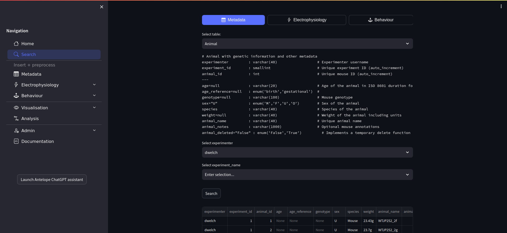

Welcome to Antelop's documentation!
====================================

**Antelop** is a data storage and processing platform for neuroscientists.

Antelop consists of a centralised lab storage server (built on MySQL and S3), and a set of computational pipelines to process and analyse this data. It provides two tools for users to interact with their data:

1. A **graphical user interface**, which provides a simple and intuitive means for users to:

   * Enter experimental sessions
   * Add annotations
   * Upload raw experimental data
   * Schedule data processing jobs on a HPC
   * Test different processing parameter sets
   * Analyse the results
   * Query the database and download results

2. A **python package**, which provides:

   * A comprehensive set of standard analysis functions
   * Interaction with the database through SQL queries
   * An object-oriented paradigm for extending the analysis suite
   * A strict data-hashing based reproducibility system for analysis function runs

    Antelop user interface

Why should I use Antelop?
--------------------------

Modern neuroscience labs have to deal with increasingly large amounts of data, along with increasingly complex computational processing of this data. Many labs leave data management up to the individual researchers, who typically design their own file hierarchies, and their own scripts to parse these files and process them. This leads to poor reproduceability, difficulties with collaboration and sharing of data, and can be time consuming for the individual researchers. Many labs therefore seek a solution to centralise their data storage and processing, in a way that can easily be used by all the lab's researchers.

A number of tools exist to address these challenges, such as relational databases such as MySQL for storing structured data, object stores such as Amazon S3 for unstructured data, and scientific workflow systems such as Nextflow for creating complex computational pipelines. However, constructing a working data platform using these and other tools is time consuming and challenging. Neuroscientists should be able to spend their time doing neuroscience, not data engineering.

However, the requirements of different systems neuroscience labs are often fairly uniform. For example, if a lab performs electrophysiology experiments, they typically want to store the raw experimental output from their acquisition system, and extract both LFPs and spike trains from this raw data, before applying a number of analysis routines on this extracted data, most likely involving behavioural data from the trial. We believe that a platform that allows these steps to be done, with the flexibility to incorporate a range of different experimental setups and computational infrastructures, with highly customizable processing parameters, and an extendible set of analysis tools, could be an immense benefit to a number of neuroscience labs.

A few different projects already exist that address some of these challenges. Most notably, `DataJoint <https://datajoint.com/>`_ provides a means of constructing data pipelines based on a SQL database, with user-defined computational steps populating downstream tables in a reproduceable manner. DataJoint Elements provides pre-defined computational pipelines for a range of neuroscience applications. However, DataJoint Elements still requires users to interact with their data in a programmatic way, and has its own learning curve that can be a barrier to its adoption by many neuroscientists. Our pipelines are designed to be as simple and interpretable as possible, and can be interacted with fully graphically to facilitate the adoption of the platform by a wide range of users.

For these reasons, we have built Antelop with the following features:

* The database and user interface can be centralised for a single lab, so all lab members can use it instantly in their browser without requiring different installs.
* The user interface is intuitive to use and user-friendly. Researchers can immediately start uploading, annotating, processing and analysing their experimental data.
* The schema is designed to be as simple as possible while still capturing enough structure for advanced analysis.
* Standard data processing and analyses are provided out of the box in the user interface.
* For more tailored analyses, the python package is easily extendible.
* Antelop supports a range of different hardware infrastructures, including:

   + The choice between self-hosting the database or using web services such as AWS.
   + Support for a number of computational environments, including the option to run heavy computations on a HPC, a dedicated computing server, or locally.
   + The choice of a persistent web interface on a dedicated server, or running the GUI locally like a Jupyter notebook.

* The setup is made as simple as possible, namely:

   + The MySQL database and S3 store can be installed and configured quickly via docker containers.
   + The cluster pipelines run on Nextflow with all dependencies containerised, and we provide a simple install script to configure and set this up.
   + The user interface and python package can be installed locally via pip, and are configured via a simple command line tool or a toml file.

* The benefits of a SQL database all apply, including:

   + Centralised data storage for the lab
   + Simple management of user permissions
   + Easy sharing of data with collaborators
   + The ability to perform automated/manual backups of the entire database
   + Very fast and flexible database queries

Supported experiment types
--------------------------

At present, Antelop supports the following experiment types:

* Extracellular electrophysiology

   + Supports a wide range of probes, such as tetrodes, neuropixels, or custom probe designs
   + Supports a wide range of the most popular modern spike sorters
   + Is integrated with phy for manual curation
   + Allows for localisation of units through the probe insertion coordinates
   + Provides a set of standard analysis functions and visualisations for the unit spike trains and LFPs

* Behavioural data

   + Supports a range of behavioural data types, such as videos, hardware ttls, or tracking data
   + The geometry of your behavioural rig and all hardware acquisitions are specified via a custom json file
   + Data is then automatically parsed and stored in the database in stuctured arrays
   + We also incorporate the training and inference of DeepLabCut models for tracking

* Analysis suite

   + Provides a broad set of standard analysis functions for electrophysiology and behavioural data, such as spike-triggered averages
   + Also provides a set of visualisations for these analyses, such as raster plots and tuning curves
   + Writing custom analysis functions is straightforward, and we provide a particular object-oriented paradigm for your own functions that performs database queries for you under the hood

In the near future, we plan to incorporate the following additional features:

* Calcium imaging

Credits
-------

Antelop is built upon a number of existing projects, without which, its development would not be possible. Most notably:

* `Streamlit <https://streamlit.io/>`_ (for the user interface)
* `Neo <https://neo.readthedocs.io/>`_ (for reading a wide range of electrophysiology acquisition inputs)
* `Spikeinterface <https://spikeinterface.readthedocs.io/>`_ (for the containerised spike sorters and electrophysiology processing)
* `DeepLabCut <https://www.mackenziemathislab.org/deeplabcut>`_ (for animal tracking)
* `DataJoint <https://datajoint.com/>`_ (for the SQL queries)
* `Nextflow <https://www.nextflow.io/>`_ (for constructing computational pipelines)

Contents
--------

.. toctree::
   :maxdepth: 2

   ui/index
   python/index
   installation/index
   developer/index

.. note::

   This project is under active development
