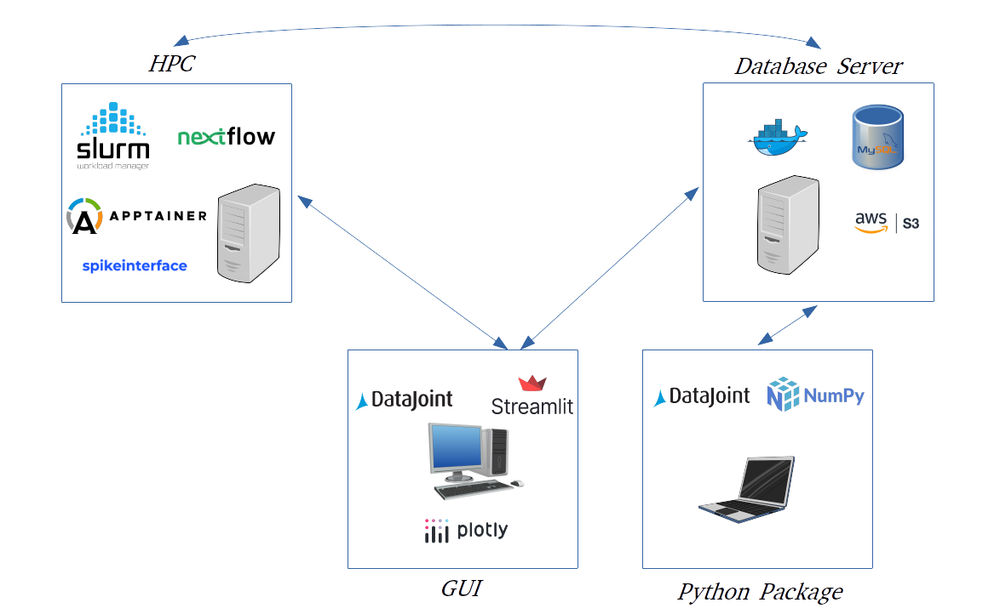

Administration and Installation
===============================

.. toctree::
   :maxdepth: 1
   :titlesonly:
   :hidden:

   cluster
   database
   admin

Our goal with this project is to provide a fully open source means of managing your own data in a professional, high-throughput and reproducible manner. Other projects that facilitate this tend to be commercial, due to the complexities involved: you just pay a subscription and they take care of the rest. The benefits of Antelop over this approach include:

* Transparency through open-source, community-oriented development
* Ownership and control of your own data
* Deployment flexibility to suit your available infrastructure (ie cloud vs self-hosted database, HPC vs local compute)

This self-managed approach has its tradeoffs, however. Notably, each lab must have at least one member with the technical background necessary to act as the database administrator. Despite the complexity of Antelop, we aim to make installation and administration as accessible as possible through our installation scripts and extensive documentation here. We aim to make Antelop easy to setup in just a couple of hours with the necessary prerequisites by an administrator with basic familiarity with unix systems, bash, docker, and HPCs.

.. rubric:: Infrastructure

The above figure illustrates the three main components of Antelop: the HPC/cloud-compute server, the database server, and the user interface installations on local machines. Each component has different prerequisites, and requires different software to be installed.

The installation of the user interfaces are documented in the respective user documentation. The installation of the HPC/database components is detailed in the following pages.
