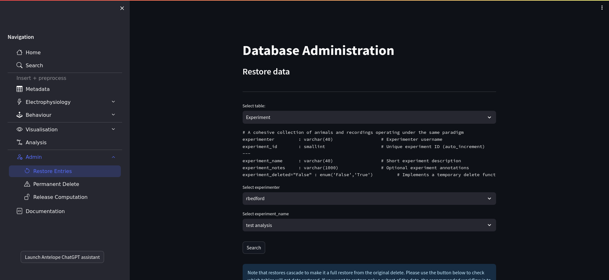

Admin
-----

Note that the admin pages are only available to database administrators. They allow database administrators to restore temporarily deleted data, permanently delete data, and release data from computation.

If you are familiar with the rest of Antelop then these admin pages should be self-explanatory. However, the exact behaviour of certain functions here need discussing, particularly with regards to data integrity.

   Antelop admin page

.. _admin:

Restore entries
^^^^^^^^^^^^^^^

It is important that no undeleted entries have deleted parents - for example, a non-deleted trial in the database can't belong to a deleted animal. The behaviour of the cascading needs to ensure this relationship always holds.

You can therefore only restore entries that have parents that are undeleted, such as a deleted trial with an undeleted animal. These restores cascade, so restoring a trial will also restore all of its attached electrophysiology data, for example.

Permanent delete
^^^^^^^^^^^^^^^^

You can permanently delete any temporarily deleted entries, regardless of the state of their parents. Permanent deletes also cascade. This option should be used with the utmost caution!

Release computation
^^^^^^^^^^^^^^^^^^^

You can also release entries from computation. Before doing so, make sure you understand why this computation failed. For electrophysiology, the computational state is tracked through the spikesorting table. The behaviour here depends on whether the computation was a spikesorting job, or reuploading the results of manual curation. In the spikesorting case, this amounts to a permanent delete of the spikesorting entry. This is because there is no downstream data that needs to be kept, and we need to free up the spikesorting entry so the spikesorting job can see that this entry hasn't yet been computed. On the other hand, if it got stuck while reuploading manual curation data, the behaviour is to simply revert the spikesorting entry back to the not in computation state. This is because there is important downstream data that needs to be retained.
