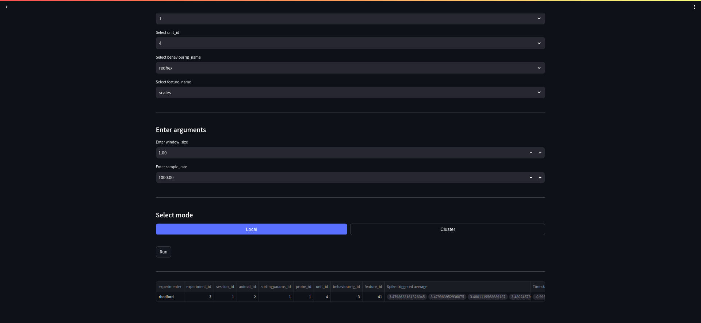

Analysis
========

Run analysis
------------

   Antelop analysis page
   
The analysis page allows you to run any analysis on your data in the database.

Writing functions
^^^^^^^^^^^^^^^^^

Analysis functions include the analysis functions present in the Antelop standard library, and additionally, custom analysis functions found in the analysis folders you have defined in your configuration file. Custom analysis functions are written in Python and must follow a certain structure. This is detailed in :ref:`analysis`.

While writing analysis functions, it is convenient to be able to reload your edits without restarting the gui. To do this, just use the reload button.

Data input
^^^^^^^^^^

When a function is written correctly within our guidelines, Antelop is able to automatically detect the input data it requires, and allows you to query the database graphically to automatically run your routines on a subset of the database without having to fetch data manually. Additionally, it is able to read the parameters your function takes to allow interactive input. It also reads the output types of your function to save or display results of different data types appropriately.

Functions are organised into 'folders', which correspond to the name of the script they belong in. After selecting a function, you then select the subset of the database you want to run your function on, and input parameters to the function.

Running analysis
^^^^^^^^^^^^^^^^

Local mode
""""""""""

There are then two modes to run your analysis. Local mode lets you run the function on your local machine. This can be useful on small datasets, or to test your function as you write it. Most results are displayed in a dataframe, however, if your function returns a Matplotlib figure, then figures will be displayed in different tabs.

Cluster mode
""""""""""""

If you are running your function on a very large dataset, then we recommend using cluster mode. In this mode, you are able to are able to select computational parameters such as the number of CPUs, memory, and the estimated time of the job. We parallelise the operation of this so that different database entries are processed in parallel on a single core each. This is because we assume most analysis functions are written in a single-process manner (for example, most of our standard library is essentially pure NumPy). If you are writing more complex analysis routines that leverage multiple cores, or GPUs, then it is recommended to write this outside of our analysis framework, using your own DataJoint queries to fetch data and manage parallelisation yourself.

You also need to select a location to save your results, as they will not be displayed in the gui. Our output creates a new folder with the results inside. Results are saved as pickled Pandas dataframes. They can be loaded back into Python using the `pd.read_pickle` function. Figures are saved as PNGs, and their relative file path is included as a link in the dataframe.

We also save a custom json file called `query.json` which is designed to facilitate reproducibility for publications. More detail on this is detailed below.

Reproduce analysis
------------------

Our custom json file aids reproducibility by specifying exactly the analysis function that was run, the exact database restriction it was run with, as well as a hash of the function and of the database fetch results, to ensure data consistency. This file can be used to rerun the exact same analysis on the exact same data, and is designed to be included in supplementary materials for publications. For details of this, see :ref:`reproducibility`.

The gui page to do this is very simple: you jsut need to select your reproducibilty json file. You can then check the hashes, which checks whether all the criteria needed for reproducibility are met, and can then run your funciton just like before.
