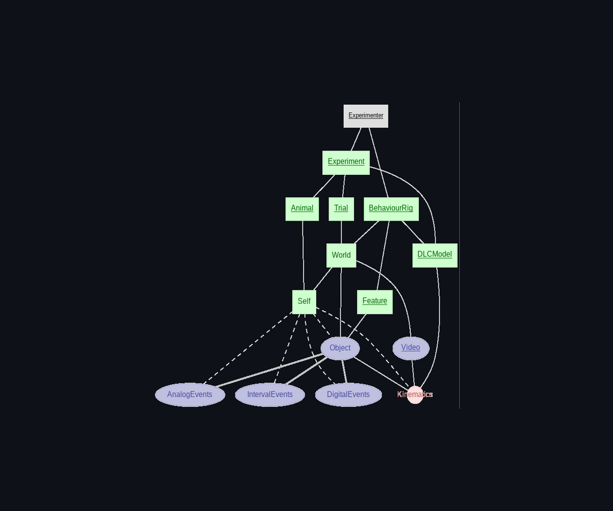

.. _behaviour:

Behaviour
---------
Antelop provides a comprehensive database structure to store all behavioural data associated with your experiments. This includes videos of the session, tracking data processed by DeepLabCut, a variety of recorded digital and analog events, as well as a description of your behaviour rig including its geometry.

There are a lot of components involved in making our behavioural schema work. This is because, unlike electrophysiology or calcium imaging data, the behavioural data you want to record and store can vary considerably from experiment to experiment. We have therefore put considerable effort into designing a schema that can accomodate a wide range of setups, while including all the necessary data in a clear and usable format.

Before we begin using the behavioural schema, there are a few overarching points that need to be discussed. First of all, due to the wide variability in data acquisition systems, we enforce that data can only be imported into Antelop from a single file type: `NWB <https://www.nwb.org/>`_. NWB is a fantastic project, and its creators have already put a lot of work into creating a very flexible yet structured file type. There exist many tools to convert data from common acquisition systems to NWB, and guides on how to write your own conversion scripts if your data acquisition methods are more custom. We would strongly recommend that you make use of this fantastic tool anyway.

It is worth discussing the different data types that we support and the schema in detail. First of all, any given session takes place in a given recording rig, which we call the 'World'. Any given session can contain one or more animals, which are referred to as a 'Self'. All Objects in the World must be predefined features of the behavioural rig (which includes a description of any animals which will be in the rig). Objects can be just an element of the rig, such as an LED, or they could belong to an animal in the rig, such as a head sensor or a bodypart we want to track, in which case it would reference Self. Separately from Objects in the rig, there are also Videos of the rig. We allow for multiple cameras recording the same rig during the same session.

In terms of actual data acquired during a session, we support 4 different data types, which all belong to an Object in the World. These tables all consist of metadata, and numpy data arrays, and numpy timestamp arrays. We assume that your acquisition system is callibrated to that all data shares a common clock. The data types are as follows:

- Analog: This is for any continuous data you want to record, such as a force sensor, or a microphone. The data array consists of continuous values that match the timestamps samples in the timestamp array.
- Digital: This refers to data that takes a continuous value, but occurs at discrete timestamps rather than being continuously sampled, like a reward amount.
- Interval: This refers to an event that occurs over a period of time, such as a stimulus presentation. The data array consists of 1s and -1s indicating the start and stop times of the event.
- Kinematics: This is for any data that is a 2D or 3D position of an object in the rig, such as a bodypart. The data array consists of the x, y, and prediction certainty values of the object in pixel values, aliging with the timestamps array. This will typically belong to an Self and be processed in DeepLabCut, however, sometimes objects can have kinematics too (such as a cricket).

Note that some acquisition systems sample with a fixed sampling rate, while others can have variable rates, skipped frames etc. For consistency, data with fixed sampling rates is converted to still have a timestamps array, so that analysis routines can run on all data regardless, and to make the dependence on the global world clock explicit.

Additionally, we provide another table called 'Masks'. This table has the same structure as IntervalEvents, but instead of indicating events in the session, it is designed to split up the entire recording sessions into individual trials. This table is completely optional to use, but for many experiments, it will prove very useful, as recordings naturally split into different repeats of the same trial. Many of our analysis routines depend upon the existence of a mask - they then split all the data from the recording into trials and compute metrics on different trials separately. We will describe these further in behaviour-masks_.

Define behaviour rig
^^^^^^^^^^^^^^^^^^^^

The first crucial component of the schema is the definition of your behaviour rig. This information is stored in a top-level table, in a custom json-based format. This json file must follow a specified structure (json schema). This file serves two key purposes:

- It provides a clear description of the elements of your behaviour rig, including their data types and geometries.
- It provides a mapping between the NWB file and our database schema that allows us to automatically import data from the NWB file into our database.

Sometimes, it is helpful to manually define this json rig outside antelop, and then import it into the database. To do this, refer to the json schema in json-schema_. The general structure is not as complex as it seems, which we will describe shortly.

However, to make things easier, we provide a graphical user interface to define your rig structure. This process is a bit fiddly and requires care to ensure your data gets imported correctly. However, note you will only ever need to do this a handful of times per lab, once for each behaviour rig you use, then all further features are fully automated!

First of all, you need to define the videos present in the rig. Often, you will have one or more cameras. These need to be assigned a name, a file type, an optional description, and optionally, a reference point description which says what the (0,0) pixel coordinates align with (more on this later). The name must exactly reference the video name in the NWB file - NWB works by storing external videos in the same directory as the NWB file itself, and points to it with a link, so the video can be utilised like an internal NWB feature, under the `acquisition` heading.

Additionally, you need to define the features in your rig. All features must align one-to-one with objects in your NWB file, except for bodyparts which you want to track with DeepLabCut, which don't need to be in the NWB. We will briefly describe the features of a NWB file that are relevant here:

NWB splits data based on how it was acquired: was it raw collected data, was it preprocessed, was it a user defined stimulus, etc. You must select whether this feature is stored in the NWB under `acquisition`, `stimulus`, or `processing`. Processing data, in particular, requires an additional path (a string potentially with slashes separating paths), to show where in the processing module this feature is. The additional option, `DeepLabCut`, refers to features in the rig that will be processed internally in Antelop using DeepLabCut. These must be predefined at the time of rig definition. These would be bodyparts on an animal that you want to track, for example. These will always be kinematics data type. Note we also support DeepLabCut data that is processed outside antelop, and is therefore under `processing`.

There is then the question of data ownership. Stimulus data can only belong to the world, while acquisition and processing data can belong to the world or an animal in the world. For the general description of the rig, we do not know which animals will be used, but we do know how many animals there will be. For single animal experiments this is very simple - you jsut say it belongs to self. For multi-animal experiments, we need to index the hypothetical animals, so we can say this feature (such as a bodypart or measuring device) belongs to animal 1, this one to animal 2, etc. When inserting data later, you then link these hypothetical animals to the actual animals used.

After that, you select the data type, `analog`, `digital`, `interval`, or `kinematics`, as described above. All non-kinematics features also have a geometry. This is optional to use, but can be very helpful for certain types of analysis. How you define your geometry is up to you, but we would often recommend using pixel coordinate values relative to a video reference point, or the global reference point. As an example of the usage of this, we have multiple copies of the same rig, where we have callibrated these geometries for each rig so certain stimuli are in exact pixel coordinates relative to our single video frame. We then use internal DeepLabCut tracking, and a single reusable analysis function that can calculate angles and displacements of the animal vs the stimuli automatically for each rig at each timestep.

Finally, note that masking functions are defined and belong in the behaviour rig table. However, the workflow is in fact much, much easier if you define them after importing some data. Once you have imported some data, we recommend you read the section behaviour-masks_ to see what masking functions do and how to use them.

Add features
^^^^^^^^^^^^

Sometimes you may want to attach additional files or annotations to the features in your rig. For example, if a feature is a digital event that consists of showing an animal a video stimulus at set timepoints, you may want to attach this actual video file to the feature. This page lets you attach any additional data you want for your own reference or customised downstream processing.

Import behavioural data
^^^^^^^^^^^^^^^^^^^^^^^

Before importing a new behavioural session, make sure you have entered a new session in the metadata schema. Any behavioural session must belong to both a session and a behaviour rig in which the session was recorded. Additionally, if you have any videos attached to this recording, you can choose to use them in your training set for a DeepLabCut model - this is optional. If the rig requires one or more animals, you can then also select which animals were used in this session.

Finally, you then browse your machine to upload the NWB file. The first thing that will occur is Antelop will check the NWB file is valid - that is, that it aligns perfectly with the definition of all the features in your behaviour rig. If it is invalid, you will get an error, and you will need to probably correct your behaviour rig definition (unless of course the NWB file itself is somehow at fault). The data will then be uploaded. If there are large external video files to be uploaded, this will occur in a background thread. Additionally, note that masking functions, discussed in behaviour-masks_, will be computed automatically for you at this point if already present in the database.

.. _behaviour-masks:

Compute masks
^^^^^^^^^^^^^

Often, your recording session will have a logical separation splitting it into different 'trials'. For example, you may do an hour long recording in which you have behavioural variables, tracking data, and electrophysiology, and within this hour recording you may want to define, say, 100 trials of 20 seconds each, where the animal repeated the same action, separated by stretches of recording where the trial resets, which you may want to discard. This type of separation can then be used for analysis - you can collate success ratios, align neural activity within these windows, etc.

We therefore provide a table called `Masks` which provides a flexible means of defining the trials present in a recording. In particular, the masks table contains data and timestamps arrays with exactly the same structure as the `IntervalEvents` table, so 1 represents trial on times, and -1 represents trial off times. The difference is that these signify the start and end of a trial, rather than an event within a trial. This allows you to 'mask out' the unwanted portions of your recording.

Since the act of splitting any data into different trials is expected to be such a common operation when performing analysis, we therefore provide a special utility function to do this for any data, timestamps pair (be it electrophysiology data, behavioural data, etc). This is used as follows:

.. code-block:: python

    from antelop import split_trials

    mask = (Mask & restriction).fetch1('data','timestamps')
    events = (AnalogEvents & restriction).fetch1('data','timestamps')

    trials = split_trials(events, mask)

So note that both the events you want to split, and the masks, must be tuples of ``(data, timestamps)`` as inputs to the function. This function will return a python list of trials, of which each element is a tuple of ``(data, timestamps)``, which are numpy arrays. This can then be looped through so your analysis can run separately on each trial, you can collate data across trials, etc.

The way that you define masks can vary considerably from trial to trial. Therefore, your masking function must be written in code, and we utilise our well developed analysis framework for this purpose. Your masking function is just like any other analysis function, but it must have the additional attribute `mask` set to True, so that Antelop knows its purpose, and additional, it must return a data, timestamps array pair only, with the 1 on -1 off structure described above. It additionally must query the `World` table. It can utilise any behavioural data or other data in the database. Masks are to be defined for a particular behavioural paradigm, and therefore belong to the rig. Additionally, you can define multiple masks with different meanings in parallel for a given rig, then can pick and choose which is used for each analysis.

For example, we have defined a masking function for a specific behaviour as follows. The idea is that trials begin when LED turns on, and ends when a port is triggered. This is a fairly minimal example - we expect that often your logic will be more complex.

.. code-block:: python

    @antelop_analysis
    class ExampleMask:

        name = 'example_mask'
        query = 'World'
        data = 'IntervalEvents'
        returns = {'data':np.ndarray, 'timestamps':np.ndarray}

        def run(key):

            # fetch scales data and port data
            port_data, port_timestamps = (IntervalEvents & key & 'intervalevents_name="port"').fetch1('data','timestamps')
            led_data, led_timestamps = (IntervalEvents & key & 'intervalevents_name="led"').fetch1('data','timestamps')

            # find the start and end of the trial
            trial_start = led_timestamps[led_data==1]
            trial_end = port_timestamps[port_data==1]

            # collate into a single array - we first append then sort both arrays together
            mask_data = np.append(np.ones_like(trial_start), -1*np.ones_like(trial_end))
            mask_timestamps = np.append(trial_start, trial_end)
            sorted_indices = np.argsort(mask_timestamps)
            mask_data = mask_data[sorted_indices]
            mask_timestamps = mask_timestamps[sorted_indices]

            return mask_data, mask_timestamps

In terms of workflow, it is recommended that you upload at least one session for a given rig before attempting to define any masking functions. We then recommend that you write your masking function, and test its results using the python interface. Once you have run it, we recommend that you come back to this page, and select the masking function that you want for this specific rig. You can then upload the function to the database, and recompute any masking functions that are outstanding. If you come back and modify your masking functions, the computed masks will be deleted, and you will need to rerun them. Once a masking function is in the database already, future masks will be automatically computed by Antelop during the data insertion phase.

Label frames
^^^^^^^^^^^^

The following sections are concerned exclusively with training and using a DeepLabCut model inside Antelop. This is an extremely useful feature of Antelop. For any behavioural rig, you can train one or more DeepLabCut models, and then all subsequent sessions using that rig can have their kinematics data automatically extracted using the trained model.

Before you can use a model, you need to annotate some training data, and train the model. This first section is concerned with annotating data for training. To do this, you must have at least one session in the database for this behaviour rig, with a video attached to it. You can choose for each session whether or not to use it as a part of the training set for your model. Also, note that prior to annotating frames, you must be using a behaviour rig that has `DeepLabCut` features defined in it, otherwise there will be no features to track.

This page walks you through the steps required to get a training data set. Once you have selected which videos belong to the training set, you need to download them to your local machine. This is done in the background, and data is saved to a temporary location for use by Antelop, so you don't need to explicitly worry about managing your DeepLabCut folder. Once the download is complete, you must select the parameters for your DeepLabCut model. These should be fairly self explanatory, however, we recommend that you refer to the `DeepLabCut documentation <https://DeepLabCut.github.io/DeepLabCut/docs/standardDeepLabCut_UserGuide.html>`_ for more information on what these parameters mean.

Once this is complete, you can then extract frames for annotation. Finally, you can open DeepLabCut's napari-based viewer to annotate your frames. Again, this interface should be straightforward to use, but refer to the documentation if you have any issues. It's also very important to save you annotations within napari before uploading to the database. Once you're happy with your saved frames, you can upload them to the database, for automatic HPC-side training.

Train DeepLabCut
^^^^^^^^^^^^^^^^

This page very straightforwardly allows you to schedule DeepLabCut model training on the HPC. You just select the model, with labelled frames, that you want to train, and it will get scheduled on the cluster.

Additionally, you can check the performance of a trained model. Antelop displays a number of performance metrics of the model, and the inference performed on the test and train data sets, which allows for a visual inspection. If you are happy with the model's performance, then you can use it with your rig for the rest of your experiment. If not, the recommended workflow is to delete your model, and go back and relabel with more data, and potentially different parameters, and train again.

Extract kinematics
^^^^^^^^^^^^^^^^^^

Once you have a model you are happy with for your experiment/rig, then Antelop provides fast, parellelised inference on your uploaded sessions on the HPC. Just like spikesorting, you can run this periodically on any data you have that hasn't yet had inference run on it. The results are then stored in the database, and can be used for analysis.

.. _json-schema:

Json schema
^^^^^^^^^^^
The formal definition of the behaviour rig json schema for reference:

.. code-block:: json

    {
        "$schema": "http://json-schema.org/draft-07/schema#",
        "type": "object",
        "properties": {
            "specification": {"type": "string", "const": "antelop-behaviour"},
            "version": {"type": "string"},
            "reference_point": {"type": "string"},
            "features": {
                "type": "array",
                "items": {
                    "type": "object",
                    "properties": {
                        "name": {"type": "string"},
                        "source": {
                            "type": "object",
                            "properties": {
                                "source_type": {"type": "string", "enum": ["acquisition", "stimulus", "processing", "deeplabcut"]},
                                "module": {"type": "string"},
                                "video": {"type": "string"}
                            },
                            "required": ["source_type"]
                        },
                        "ownership": {
                            "type": "object",
                            "properties": {
                                "ownership": {"type": "string", "enum": ["world", "self"]},
                                "animal": {"type": "integer"},
                            },
                            "required": ["ownership"]
                        },
                        "data_type": {"type": "string", "enum": ["digital", "analog", "interval", "kinematics"]},
                        "coordinates": {
                            "type": "array",
                            "minItems": 3,
                            "maxItems": 3,
                            "items": {
                                "type": "number"
                            }
                        },
                        "description": {"type": "string"}
                    },
                    "required": ["name", "source", "data_type", "description"]
                }
            },
            "videos" : {
                "type": "array",
                "items": {
                    "type": "object",
                    "properties": {
                        "name": {"type": "string"},
                        "description": {"type": "string"},
                        "format": {"type": "string", "enum": ["avi", "mp4", "mov"]},
                    },
                    "required": ["name", "description", "format"]
                }                   
            }
        },
        "required": ["specification", "version", "reference_point", "features"]
    }
