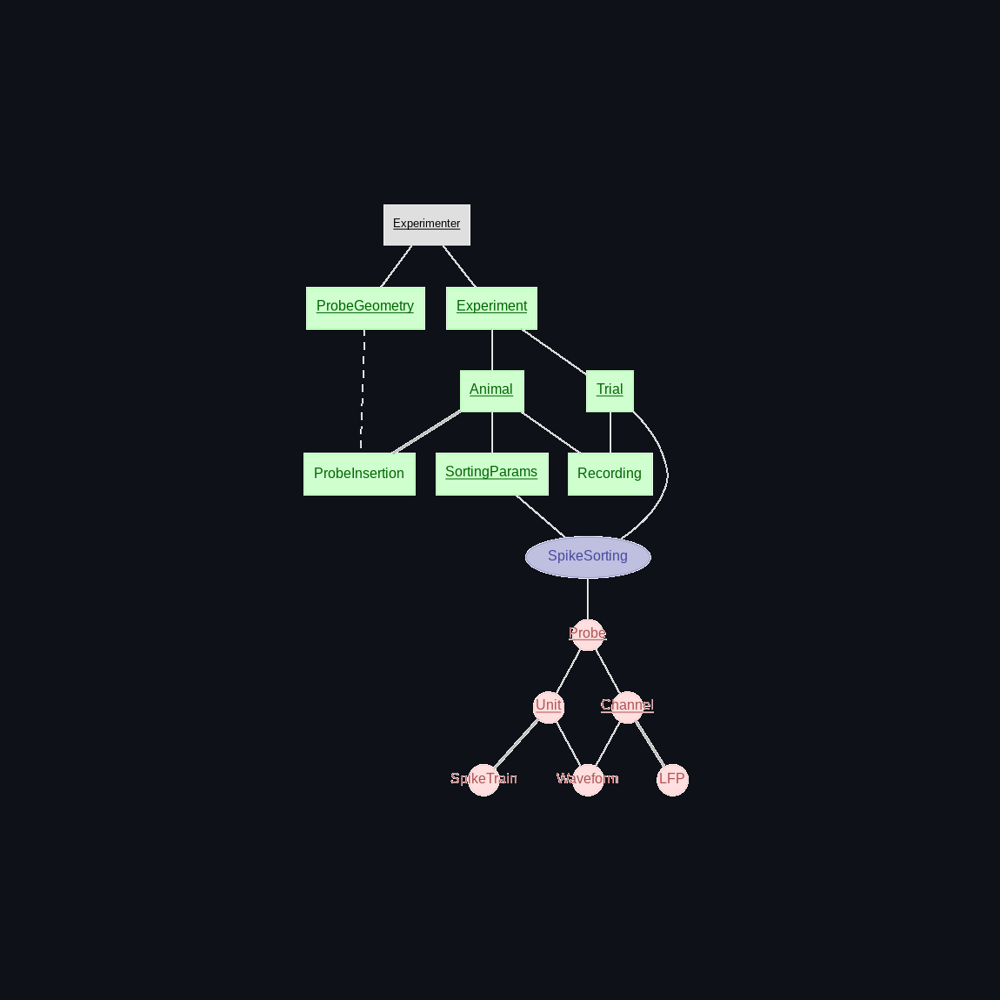

Electrophysiology
-----------------

The **electrophysiology** page allows you to insert spikesorting parameters, acquisition probes, schedule spikesorting jobs on the cluster, and manually curate your results in phy.

Before describing how to use this page, it is worth discussing the electrophysiology data that is extracted from the raw recordings. In any extracellular electrophyiology recording, the crucial data to extract is typically the spiketrains, LFPs, and unit waveforms. We aim to facilitate analysis by providing this data as numpy arrays that can be easily fetched through database queries. Importantly, for a given trial, these arrays should share a common clock, and their units and sample rates should be attached as metadata in the database. As a user, you therefore need to enter parameters for spikesorting, including preprocessing parameters, and additionally, extraction parameters detailing exactly how these arrays should be extracted, as well as information specifying the probes, and raw electrophysiology recordings.

Insert probe geometry
^^^^^^^^^^^^^^^^^^^^^

The **ProbeGeometry** table holds information specifying the geometry of the probe that will get inserted into the animals. This needs to be a json file in `ProbeInterface <https://probeinterface.readthedocs.io/en/main/>`_ format. Some common probe files can be found in the `ProbeInterface Library <https://github.com/SpikeInterface/probeinterface_library>`_, and we are hoping the number of probes here will be expanded upon shortly. For custom probe designs, such as a multiple tetrode configuration, you will need to use ProbeInterface in python to programmatically create your file. It is important that probe files should describe ProbeGroups - since Antelop can track multiple distinct probes per animal, and additionally, that probes should be 3D. 2D probes can easily be converted to 3D with probeinterface.

Some aspects of this require quite a bit of care. It is very important that you check your channel configurations and make sure this is consistent between your acquisition system and your probe file. Otherwise the calculated unit locations will be meaningless, and even worse, your spikesorting results may be meaningless, as many modern spikesorters explicitly use the probe geometry in their calculations. The probeinterface documentation details how to do this well. Most labs will have a fairly small number of probe designs that they will use, so someone with the appropriate expertise can create this file if it doesn't already exist and distribute it to lab members.

Make probe insertion
^^^^^^^^^^^^^^^^^^^^

After surgery, you can log the details of your probe insertion in Antelop. This step is necessary before spikesorting. However, if exact channel/unit locations are not critical to your analysis, this step is less important.

Specifying rotations and translations in 3D space is not straightforward - in particular, the order of operations matter. To keep things simple, we enforce a particular order. If you record your transformations differently, we recommend using the scipy.spatial.transform module to convert your transformations to our format.

In particular, probes are initially centred at the origin, with coordinates defined by the probe geometry. We then specify a rotation about the origin using Euler angles. In particular, we use sequential rotations about the extrinsic z, y and x axis respectively, as specified here::

    r = scipy.spatial.transform.Rotation.from_euler('zyx', ['yaw', 'pitch', 'roll'], degrees=True)

You can easily write any rotation in scipy, and export to our format if necessary using the `as_euler` method as follows::

    r.as_euler('zyx', degrees=True)

Finally, we then apply the translation in the z, y, x directions.

Upload recording
^^^^^^^^^^^^^^^^

Raw recordings are typically quite large and take a while to upload to the database. Under the hood, recordings are zipped and streamed to the S3 store.

You need to select your acquisition system. Possible options will be configured by your database administrator. You then need to select the path to the acquisition output folder. Each acquisition system has its own set of files that are output during recording, and Antelop will check the structure of the folder you choose to ensure it is correct, raising an error if it is not.

Finally, you also need to enter your probe z-increment. For some experiments, you might want to record at multiple depths, and this parameter allows you to specify the change in probe position. For obvious reasons, this increment is actually done in intrinsic probe coordinates, so that the probe moves straight down the probe shank. Additionally, being an increment, this should be the change since the last recording, not the absolute change. The total increment will be the sum of all increments performed prior to or at this current recording.

Insert spikesorting parameters
^^^^^^^^^^^^^^^^^^^^^^^^^^^^^^

Under the **Insert Spikesorting Parameters** page, you can add spikesorting parameters for a given animal. 

After selecting the animal you want to add parameters to, you can then select the LFP cutoff frequency. In SpikeInterface, LFPs are bandpass filtered (not lowpass filtered), so we fix the minimum frequency to 1 Hz. To be efficient in our storage, we also resample the array to be slightly above the Nyquist frequency, as this will retain all the spectral information while reducing the size of the array.

Waveforms are computed simply by slicing the preprocessed recording around the peak of the spike. You can choose how long before and after the peak to retain. Waveforms are stored at the original recording sample rate since we want the highest fidelity possible.

Preprocessing is applied to the recording before spikesorting. We apply just a bandpass filter - some spikesorters will internally also then apply whitening. You can choose the minimum and maximum frequencies for the bandpass filter.

You can then choose which spikesorter you would like to run. At present, we provide pykilosort, spykingcircus2, and mountainsort5. Each spikesorter has its own set of parameters. Often, many of the defaults will be fine, but certain parameters are very important, such as whether your spikes peak positively or negatively, which can depend on your acquisition system. Antelop attempts to give a description of each parameter if it's available. However, we strongly recommend that you read the documentations for these individual spikesorters if you are going to use them a lot, try to understand their parameters, and make sure you test a range of parameter sets.

If you only select one spikesorter, then its output will get uploaded to the database directly. This is a sensible approach when combined with manual curation in phy, but at present, may not give optimal results if left as is. We therefore allow you to select more than one spikesorter to run in parallel. We will then run an agreement matching algorithm on the results, which tries to match units from different spikesorters based on their spiketrains. This can lead to more robust results in the absence of spikesorting. However, it can also be quite a harsh algorithm, leading to only a small number of units being truly matched and uploaded to the database. We therefore recommend that you set the agreement matching parameters generously - ie, a high **delta_time**, and a low **match_score** (the defaults should be adequate). You can always manually curate these results too.

You can then name your parameter set and add a description to make database queries easier, and upload these parameters to the database.

Schedule spikesorting
^^^^^^^^^^^^^^^^^^^^^

Under the **Schedule Spikesorting** page, you can then schedule spikesorting jobs to run on the computing cluster. These jobs are highly parallelised, so they run efficiently and quickly given your cluster resources. They automatically pull all the necessary data from the database, and upload their results to the database at the end.

You need to select the subset of your data that you want to run spikesorting on. Each session will get spikesorted multiple times depending on how many distinct parameter sets you have for the animal the session belongs to, and all of this data will get uploaded to the database. In general, this is not the behaviour that we want, as we only want the results of a single, near-optimal spikesorting. However, this feature allows you to quickly try a number of different parameter sets on a small number of sessions for a new animal, explore their results in phy, then discard all but the best parameter set. For the bulk of your experiment, you should then be spikesorting with a single parameter set, to save on processing and storage resources.

Once you've selected some data to spikesort, you can check the number of sessions and parameters, as well as the total number of jobs that will be run for this selection. Don't worry about scheduling many jobs, such as every trial from a month's worth of experiments; the parallelisation is handled under the hood by nextflow and is designed to not overwhelm your HPC limits, as configured by your database administrator, while still being as fast as possible. To then schedule your spikesorting job, you must first enter your cluster password, then press **Schedule spikesorting**. Note this is different to your antelop password which you used to login to the app - it will be the same password you used to login to the machine on which you are running the app. Once your job is running, you can monitor its progress with the **Check spikesorting progress** button. You will also receive an email confirmation once your job completes.

Under the hood, we monitor what entries are currently in computation as a means of enforcing database integrity. Any data linked to data that's currently in computation can't be modified or deleted, and you will get errors if you try. This is because the computational pipelines take a snapshot of the data they depend on as they start, perform their calculations, then upload their results at the end. If the data they depend on changes mid-computation (for example, you modify some spikesorting parameters while that spikesorting job is running), the results uploaded to the database will be the results of the older set of parameters, while the database will tell you they are the results of the newer parameters you just inserted.

Note that computational jobs do of course fail occasionally. This can be for a number of reasons, the most common ones being that you have uploaded data that is somehow incorrect or corrupted, that it has failed due to a faulty parameter, or that the job has exceeded its computational resources on the cluster. You can check the issue by reading the logs in the email sent to you by nextflow. In the meantime, the job will remain in the 'in computation' state. This is to avoid that job being rerun before the problem is fixed, which would waste resources. Once you have figured out the issue, you will need to get your database administrator to release that job from computation for you, after which you can either fix the problem and reattempt the job, or delete that entry.

Manual curation
^^^^^^^^^^^^^^^

Once you have some data that has been successfully spikesorted, you can move on to the **Manual curation** tab. All manual curation in Antelop is done with `Phy <https://phy.readthedocs.io>_`. You can then select the data you want to curate, and press the **Open phy** button. Phy is a graphical application, and will open in a new window - note this can take a few seconds. This will open Phy with the selected data. You can then curate your data as you normally would in Phy. Once you are happy with your curation, you can press the **Upload curation** button. Uploading these results is quite computationally intensive, as a lot of data conversion needs to take place, including reextracting the waveforms from the raw recording. Therefore, this gets scheduled onto the HPC like the spikesorting job. It is therefore advisable to avoid running this job an unnecessary number of times.

Note that even if you don't intend to perform manual curation, Phy is still a fantastic visualisation tool for you to explore your spikesorting results, particularly at the beginning of a new experiment when you're going to be validating your parameters. To aid with this initial assessment of your parameters, we also give you the option to delete poor parameter sets in this tab.
