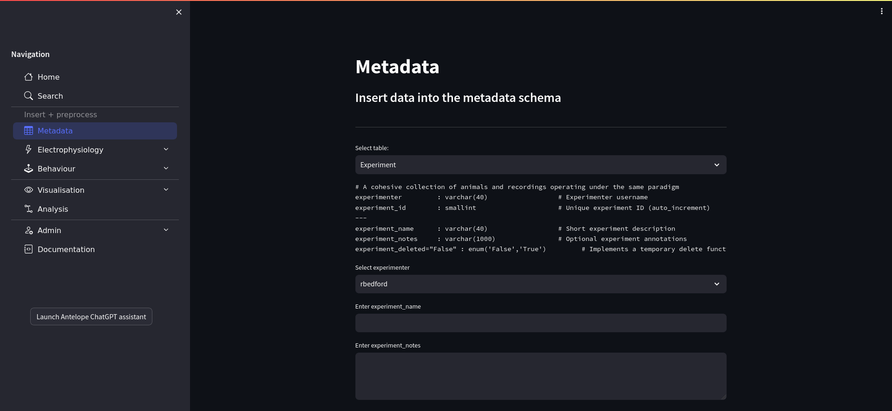

Metadata
--------

   Antelop metadata page

The **Metadata** page allows you to manually insert information about your experiments, animals, and recording sessions. The dropdown box at the top allows you to choose the table into which you want to insert an entry. Below this is a brief description of the table attributes, including their names, data type, and a brief comment describing what each attribute means. Note the dashed line separates the primary key attributes from the secondary attributes for that table.

You can then sequentially input information for each attribute in the table. How data is input depends on the data type and whether it is a foreign key or not. For example, some attributes require you to type some text, while others may require you to select a file or directory to upload. Foreign key integrity is enforced here from top to bottom, which means that if you select a particular experiment, you will only be able to select an animal that already belongs to that experiment, etc. It is therefore necessary that you enter your attributes from top to bottom.

Each manual table has a 'name' attribute. This should be used to uniquely identify that entry. Under the hood, we make use of autoincremented primary keys to identify different entries, but the name attribute is very useful for you to use when searching the database. We recommend having a common convention across the lab. For example, you will probably alread have an animal naming convention involving the animal's strain, gender, number, etc. So it is worth using that convention in antelop, but this is up to you to adhere to. It is fine if the name is not unique across different parents - for example, you could use the same animal in two different experiments. But your data will get hard to search if you use the same animal name twice within the same experiment. Additionally, the 'notes' attribute is for your own annotations, and can be useful in identifying different table entries. These annotations can be descriptive, for example, a qualititative evaluation of how a session went. However, we have also found some use in using a structured string here to include additional metadata that aided our downstream analysis routines.

Finally, once your data has been entered, you can press the **Insert** button, which uploads this data to the database. Just like with downloads and deletes, inserts can take a long time, particularly if you are uploading large raw recordings to the database, so they occur in a background process which you can monitor with the **Check insert progress** button.
