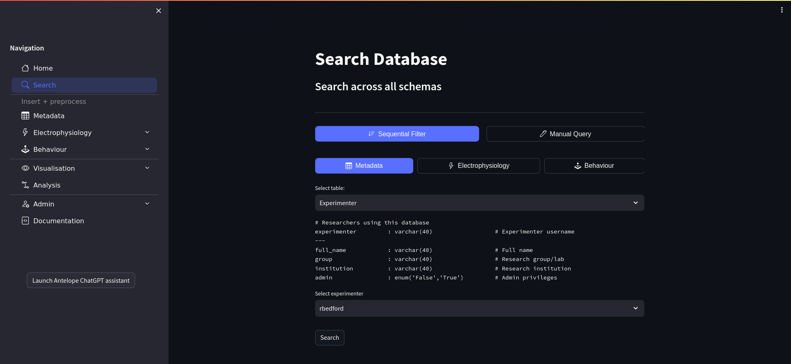

Search
------

   Antelop search page

First of all, the **search** page allows you to search the database to see what data it contains. This page has two modes of operation: sequential filter mode, and manual query mode. Sequential filter mode is the easiest to use and is preferred for simple queries, while manual query mode allows you to programmatically enter more complex database queries.

Sequential filter
^^^^^^^^^^^^^^^^^

In sequential filter mode, you first need to select the schema and table you would like to search. You will only be able to select tables that already have data in them. You then have the option to sequentially filter results for that table with the dropdown boxes. At any point, you can leave the bottom box blank, which means no further filters will be applied. For example, if you want to search all sessions belonging to an individual experiment, you would select the Session table at the top, and then sequentially select the **experimenter** and **experiment_name** attributes. You would then leave **session_name** blank. Note that the available selections depend on the selections made previously - for example, you can only select sessions belonging to the experiment you have already chosen.

Manual query
^^^^^^^^^^^^

In manual query mode, you need to type a query. For this, we use the DataJoint query syntax. This syntax involves specifying the names of the tables you are querying, alongside query operators that manipulate the results of the query. We give here a brief description of these operators. For a full description, we refer you to the `DataJoint documentation <https://datajoint.com/docs/core/datajoint-python/0.14/query/operators/>`_.

.. csv-table:: DataJoint Query Operators (source: DataJoint documentation)
   :header: "operator", "notation", "meaning"

   "restriction", "A & cond", "The subset of entities from table **A** that meet condition **cond**"
   "restriction", "A - cond", "The subset of entities from table **A** that do not meet condition **cond**"
   "join", "A * B", "Combines all matching information from **A** and **B**"
   "proj", "A.proj(...)", "Selects and renames attributes from **A** or computes new attributes"
   "aggr", "A.aggr(B, ...)", "Same as projection but allows computations based on matching information in **B**"
   "union", "A + B", "All unique entities from both **A** and **B**"

As an example, consider the following query::

    Experiment * Animal & 'experimenter="rbedford"' & 'ml_coord > 10'

This will join all the attributes from the Experiment and Animal tables, and will return the entities belonging to **rbedford** with a medial-lateral insertion coordinate greater than 10.

One final difference with manual query mode is that we don't automatically filter out temporarily deleted entries. This is so that you can have the flexibility to search whatever data you have in the database. If you want to filter out temporarily deleted entries, then you simply need to add the restriction 'tablename_deleted="False"' to your query.

For both modes of operation, you can then click on the **Search** button, which performs a query on the database. It displays a dataframe of the results of this query, showing up to 30 items, as well as a count of the total number of items. It does not show large datafiles kept in external stores, or jsons, but represents them by placeholders.

Download and delete
^^^^^^^^^^^^^^^^^^^

You then have two further options: download, or delete. You can download the results of any search, from either the sequential filter or the manual query. You need to first select a location to download the data to. The available options are the result of the configuration performed by your database administrator, and must be paths accessible to the machine on which antelop is running. It will download all data resulting from the search, not just the 30 that are displayed. The data will be downloaded as a single numpy recarray, and the file will be named based on the exact search you are performing. Recarrays are essentially pandas dataframes, and so pandas is the recommended library to load and work with your results. The following script gives a simple example of how to do this::

    import numpy as np
    import pandas as pd

    df = pd.DataFrame(np.load('/path/to/download.npy'))

In addition to the main array, external data will also get downloaded. For example, the zipped raw trial recordings will get downloaded into the same working directory. In the dataframe column referencing the external attribute will be relative paths to the external files. If you want to do custom manipulation on the external data you've downloaded, you could, for example, loop through the dataframe and use the paths to refer to the data for further manipulation, such as unzipping and processing with spikeinterface. Note that the paths in the array won't change if you move the data. Therefore, it is recommended to download to an empty directory and move the entire directory so that the references still work. Additionally, note that downloads can overwrite data which already exists with identical file names. This will only pose a problem if you repeatedly perform the same download to the same location, which is not recommended.

You can also delete the results of any sequential filter, and some manual queries, such as a single table with certain restriction filters applied, as long as the data belongs to you. You cannot delete from overly complex manual queries such as joins, as it wouldn't be clear what table you want to delete from. The app will warn you if a query can't be deleted. Deletions cascade to avoid orphaned database entries. This means, for example, that deleting an animal will also delete all the trials, spikesorting parameters and electrophyiology entries that belong to that animal. Pressing the **Check Deletes** button will show you the number of entries in each downstream table that will get deleted, whcih acts as a good check that you realy want to perform this deletion. Deletions are temporary, and can be reversed, but only by your database administrator, so it is worth double checking any deletes you want to perform. Some caution is necessary; you could, for example, delete the experiment table with no filters other than your username, which will delete all your data in antelop. For this reason, we ask you to re-enter your password to confirm deletion.

Note that both downloads and deletes can take quite some time, depending on the size of the data, and in particular, whether the data refers to large external files. For this reason, both downloads and deletes always occur in a background thread. To check the status of your download or delete, press the **Check download progress** or **Check delete progress** buttons. Note that if you quit the application while one of these background processes is underway, they will still continue to completion, however, you will lose the ability to check their status when you log back in. Therefore, it is recommended to keep antelop open when you have downloads or deletes underway. If you do accidentally close antelop, you can always check whether they completed by looking at the file system or searching the database.

