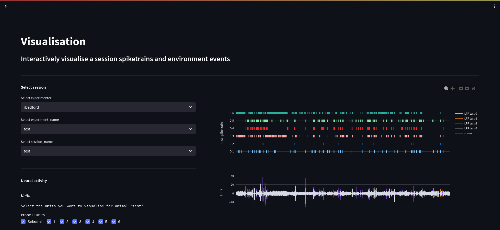
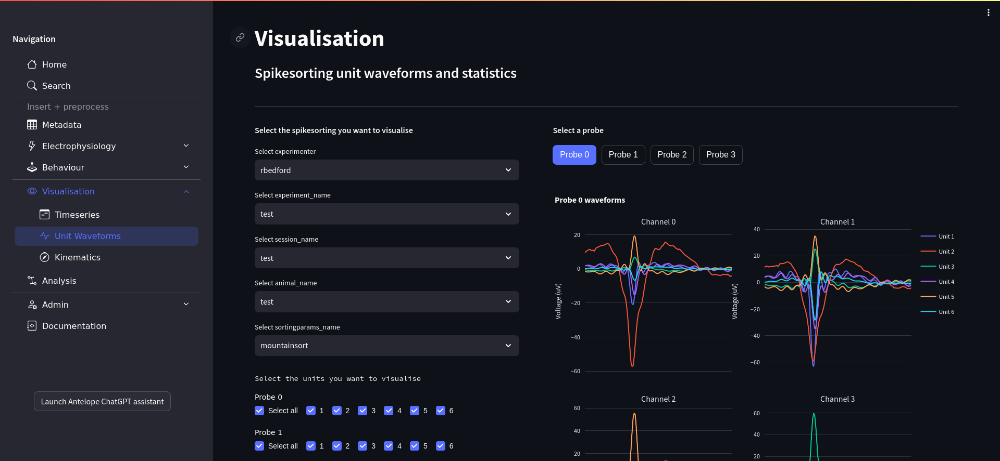

Visualisation
-------------

All of our visualisations are created in `Plotly <https://plotly.com/python/>`_. As such, they are fully interactive.

Timeseries
^^^^^^^^^^

   Antelop timeseries page

Our timeseries visualisations allows you to display spiketrains, LFPs, behavioural events and kinematics, and trial masks, all with a common clock, for a given recording session.

After selecting a session, you simply need to select the attributes you wish to display, and the timerange of the recording. Attributes include units, LFPs, all behavioural and kinematics events, and masking functions. The resulting plot is fully interactive, with zoom features, object metadata, and a time slider. The timerange selection we provide may therefore seem redundant - but we recommend its use for performance reasons, since it can take a while to produce a plotly plot with lots of data, and may make your browser less responsive if its rendering an overly complex visualisation.

Under the hood, we use plotly with WebGL, which drastically speeds up the rendering of large spiketrains by using your GPU if available.

Unit waveforms
^^^^^^^^^^^^^^

   Antelop timeseries page

The unit waveforms page allows you to display the waveforms for all units in a given session. It also computes some basic quality metrics for each unit. While this doesn't provide a standin for a fully-fledged tool such as phy, it can be useful for quickly assessing the results of spikesorting.

Its use is very straightforward - just select the session and units you want to visualise, and the plots and statistics will be generated.

.. note:: This is a work in progress

Kinematics
^^^^^^^^^^

.. note:: This is a work in progress
